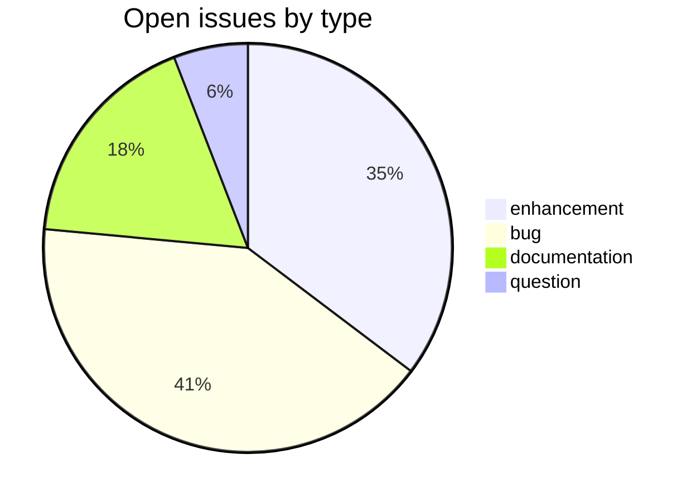
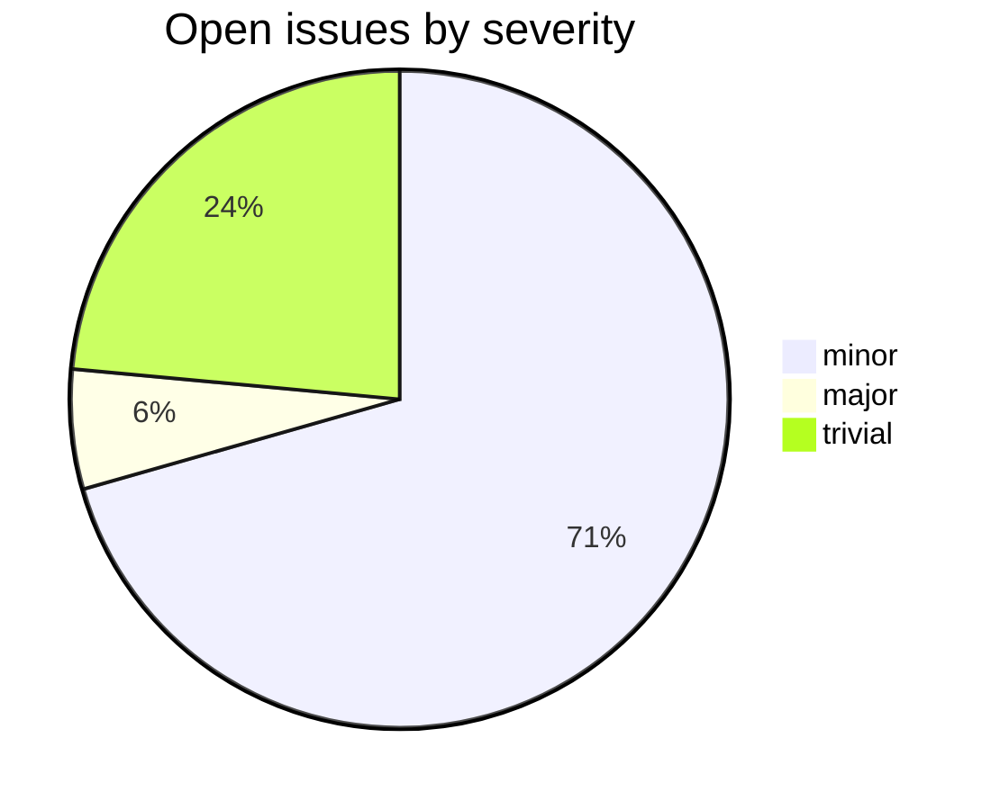

# Workflow

1. This repository generates files in which Devanagari script is used instead of SLP1 (as in csl-orig)
2. The data from csl-orig repository is processed via script [to_devanagari.py](https://github.com/sanskrit-lexicon/csl-devanagari/blob/main/scripts/to_devanagari.py) and stored in [v02/dict/dict.txt](https://github.com/sanskrit-lexicon/csl-devanagari/blob/main/v02/mw/mw.txt) file in the present repository.
3. To ensure that the change is reversible, a script [to_slp1.py](https://github.com/sanskrit-lexicon/csl-devanagari/blob/main/scripts/to_slp1.py) is also prepared.
4. After one pass from to_devanagari.py and to_slp1.py, the result is stored in slp1/dict.txt file.
5. slp1/dict.txt file is compared with [csl-orig/v02/dict/dict.txt](https://github.com/sanskrit-lexicon/csl-orig/blob/master/v02/mw/mw.txt) file.
6. slp1 folder is not tracked in this repository, as it is only holds intermediate files for comparision.
7. If there are any differences noted, they are shown in [diff/dict.txt](https://github.com/sanskrit-lexicon/csl-devanagari/blob/main/diff/mw.txt) file in this repository.
8. Ideal situation should be that there is no difference between both files.

# Dependencies

https://pypi.org/project/indic-transliteration/

# How to regenerate for a specific dictionary?

`cd scripts; bash redo.sh dict` e.g. `cd scripts; bash redo.sh mw`

# How to regenerate for all dictionaries?

`cd scripts; bash redo_all.sh`

# csl-devanagari

CDSL **converter** repository in the Sanskrit Lexicon project.
Converts SLP1 data from `csl-orig` into Devanagari for easy proofreading.

## Tech Stack

- **Runtime**: Python 3
- **Build**: plain `python` scripts
- **Input**: SLP1 dictionary text from `csl-orig`
- **Output**: Devanagari preview pages

## Issues Overview

**Total** (open + closed snapshot 2026-05-29): includes 17 open.

### By Milestone

| Milestone | Open | Closed | Total |
|---|---:|---:|---:|
| API Stability | 0 | 0 | 0 |
| User Experience | 7 | 0 | 7 |
| Data Quality | 6 | 0 | 6 |
| Developer Experience | 3 | 0 | 3 |
| Community | 1 | 0 | 1 |

### By Type

### By Severity

## GitHub Issue Conventions

Follows the [Cologne tooling-repo taxonomy](https://github.com/sanskrit-lexicon/csl-observatory/blob/main/runbook/cologne-tooling-runbook.md):

- **17 type labels** across 5 categories
- **4 severity levels**: trivial, minor, major, critical
- **5 milestones**: API Stability, User Experience, Data Quality, Developer Experience, Community
- **Domain labels** scoped to converter: `domain:transcoding`, `domain:roundtrip`, `domain:edge-cases`
- **Org Project**: [Tooling Roadmap](https://github.com/orgs/sanskrit-lexicon/projects/9)

See [CLAUDE.md](CLAUDE.md) for full definitions.

---
*Generated by Cologne Tooling Runbook on 2026-05-29*

## License

This repository contains both source code and dictionary/data files, which are
licensed separately:

- **Source code** (e.g. `*.py`, `*.php`, `*.js`, `*.sh`) is licensed under the
  **GNU General Public License v3.0** — see [`licenses/GPL-3.0.txt`](licenses/GPL-3.0.txt).
- **Dictionary and data files** are licensed under **Creative Commons
  Attribution-ShareAlike 4.0 International (CC-BY-SA-4.0)** — see
  [`LICENSE`](LICENSE).

